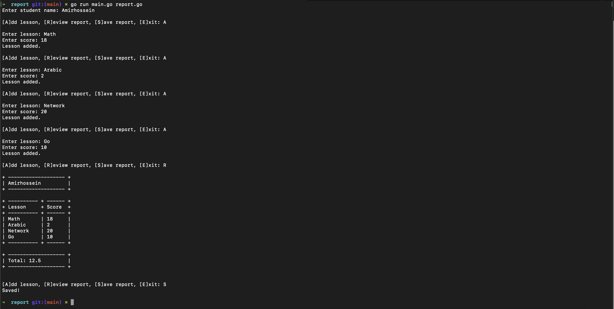

# Report

In this project (simple project (very simple project (...))) we run averything we learned until lesson 19 (files).

Using struc, user input, parsing data, writing files.

## Details

Just get a name of student age lessons to make a report for you! Like this exactly:

